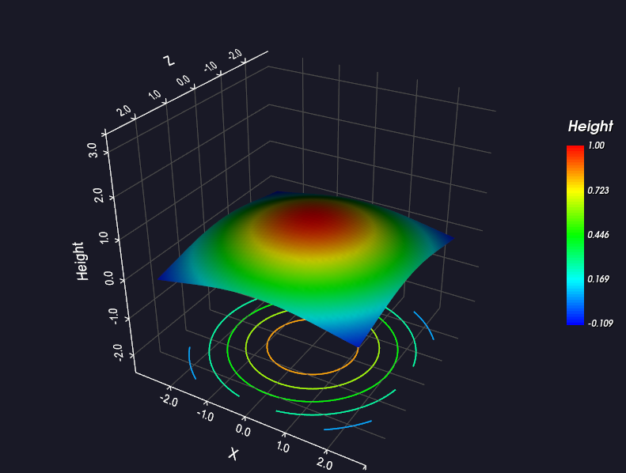
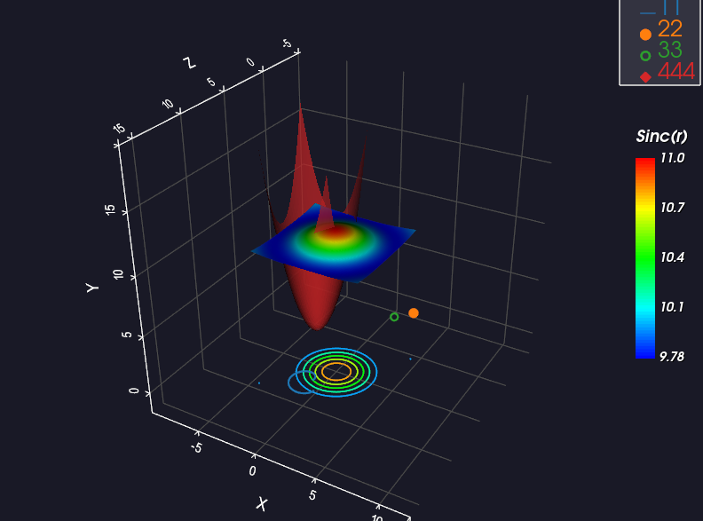

# vtkPlotBase - Qt + VTK 三维图表控件

基于 Qt 6.7.3 和 VTK 9.6 的三维可视化图表控件，提供专业的三维坐标系和丰富的图表绑定功能。

## 效果展示

<p align="center">
  
  
</p>

## 功能特性

### 三维坐标系
- 专业三维坐标轴（vtkCubeAxesActor）
- 自适应数据边界缩放
- 等比例缩放模式
- 可配置的坐标轴标题
- 网格可见性控制
- 背景颜色自定义

### 曲线
- 添加 3D 曲线（支持自动颜色）
- 自定义颜色、线宽
- 图例名称设置
- 曲线数据动态更新

### 标记点
- 空心环标记（Hollow Marker）
- 填充圆标记（Filled Marker）
- 自定义颜色、线宽
- 始终面向相机
- 三种大小模式：
  - 绝对半径模式（世界坐标）
  - 相对半径模式（占坐标轴比例）
  - 屏幕固定大小模式（像素）

### 曲面
- 单色曲面可视化
- 自定义颜色和不透明度
- Phong 着色

### 热力图曲面
- 高度映射颜色（彩虹渐变）
- 等高线投影（投影到坐标系底部）
- 颜色条（Scalar Bar）
- 可配置等高线数量
- 不透明度控制

### 图例
- 自动生成图例
- 可配置位置（左上角/右上角/左下角/右下角）
- 符号与文字间距优化

### 交互
- 鼠标旋转、平移、缩放
- 快捷键视角切换, X/Y/Z按键切换对应轴视角
- R 键重置视角

## 依赖

本项目已在以下环境中验证通过：

- Qt 6.7.3
- VTK 9.6
- MSVC 2019 64bit
- Windows 10/11

> **注意**：其他版本未进行测试，可能存在兼容性问题。

## 构建指南

### 1. 编译 VTK 9.6 动态库

本项目需要自编译 VTK 9.6 动态库。详细编译教程请参考：

[VTK 动态库编译教程](https://zhuanlan.zhihu.com/p/1981400644440069134)

### 2. 配置项目

1. 将编译好的 VTK 动态库放置到 `3rdparty/VTK-9.6/` 目录下，目录结构如下：
   ```
   3rdparty/VTK-9.6/
   ├── bin/          # DLL 文件
   ├── include/      # 头文件
   │   └── vtk-9.6/
   ├── lib/          # 库文件
   └── share/        # 其他资源
   ```

2. 使用 Qt Creator 打开 `VTKtest.pro` 文件

3. 选择 MSVC 2019 64bit 构建套件

4. 构建并运行项目

## 快速开始

### 基本使用

```cpp
#include "vtkplotbase.h"
#include "drawable/vtkcurve.h"

int main(int argc, char *argv[])
{
    QApplication a(argc, argv);
    
    vtkPlotBase w;
    w.setWindowTitle("3D Plot");
    w.resize(800, 600);
    w.setAxisTitles("X", "Y", "Z");
    
    // 添加曲线（自动颜色）
    QVector<QVector3D> points;
    for (int i = 0; i <= 100; ++i) {
        double t = i * 0.1;
        points.append(QVector3D(t, sin(t), 0));
    }
    vtkCurve* curve = w.addCurve(points);  // 返回曲线对象指针
    curve->setName("正弦曲线");           // 直接设置名称
    
    w.show();
    return a.exec();
}
```

### 热力图曲面

```cpp
#include "drawable/vtkheatmap.h"

// 创建 Sinc 函数曲面
const int nx = 60, nz = 60;
QVector<QVector3D> points;

for (int j = 0; j < nz; ++j) {
    for (int i = 0; i < nx; ++i) {
        double x = (i - nx/2.0) * 0.15;
        double z = (j - nz/2.0) * 0.15;
        double r = sqrt(x*x + z*z);
        double y = (r < 0.01) ? 1.0 : sin(r) / r;
        points.append(QVector3D(x, y, z));
    }
}

vtkHeatmap* heatmap = w.addHeatmapSurface(points, nx, nz, "Height");
heatmap->setContourCount(8);  // 设置等高线数量
heatmap->setContourVisible(true);  // 显示等高线
```

### 自动颜色

添加曲线、标记、曲面时不指定颜色，系统自动选择不重复的颜色：

```cpp
// 自动颜色（推荐）
vtkCurve* c1 = w.addCurve(points1);       // 自动选择颜色1
vtkCurve* c2 = w.addCurve(points2);       // 自动选择颜色2（不同颜色）
vtkMarker* m1 = w.addHollowMarker(position);  // 自动选择颜色3

// 指定颜色
vtkCurve* c3 = w.addCurve(points, Qt::red, 2.0);
```

预定义颜色列表：蓝、橙、绿、红、紫、棕、粉、灰、黄绿、青

## API 参考

### 曲线操作（vtkCurve）

| 方法 | 说明 |
|------|------|
| `addCurve(points, color, lineWidth)` | 添加曲线（指定颜色），返回 `vtkCurve*` |
| `addCurve(points, lineWidth)` | 添加曲线（自动颜色），返回 `vtkCurve*` |
| `setCurveVisible(curve, visible)` | 设置曲线可见性 |
| `setCurveColor(curve, color)` | 设置曲线颜色 |
| `setCurveWidth(curve, width)` | 设置曲线线宽 |
| `updateCurveData(curve, points)` | 更新曲线数据 |
| `removeCurve(curve)` | 移除曲线 |
| `clearAllCurves()` | 清除所有曲线 |

#### vtkCurve 对象方法

| 方法 | 说明 |
|------|------|
| `setName(name)` | 设置图例名称 |
| `name()` | 获取名称 |
| `setColor(color)` | 设置颜色 |
| `color()` | 获取颜色 |
| `setLineWidth(width)` | 设置线宽 |
| `lineWidth()` | 获取线宽 |
| `setVisible(visible)` | 设置可见性 |
| `visible()` | 获取可见性 |
| `updateData(points)` | 更新点数据 |

### 标记操作（vtkMarker）

| 方法 | 说明 |
|------|------|
| `addHollowMarker(position, color, screenSize, lineWidth)` | 添加空心标记（指定颜色），返回 `vtkMarker*` |
| `addHollowMarker(position)` | 添加空心标记（自动颜色），返回 `vtkMarker*` |
| `addFilledMarker(position, color, screenSize)` | 添加填充标记（指定颜色），返回 `vtkMarker*` |
| `addFilledMarker(position)` | 添加填充标记（自动颜色），返回 `vtkMarker*` |
| `setMarkerVisible(marker, visible)` | 设置标记可见性 |
| `setMarkerColor(marker, color)` | 设置标记颜色 |
| `setMarkerRadius(marker, radius)` | 设置绝对半径 |
| `setMarkerRelativeRadius(marker, ratio)` | 设置相对半径 |
| `setMarkerScreenSize(marker, screenSize)` | 设置屏幕大小 |
| `updateMarkerPosition(marker, position)` | 更新标记位置 |
| `removeMarker(marker)` | 移除标记 |
| `clearAllMarkers()` | 清除所有标记 |

#### vtkMarker 对象方法

| 方法 | 说明 |
|------|------|
| `setName(name)` | 设置图例名称 |
| `setPosition(position)` | 设置位置 |
| `position()` | 获取位置 |
| `setColor(color)` | 设置颜色 |
| `color()` | 获取颜色 |
| `setFilled(filled)` | 设置填充模式（true=填充圆，false=空心环） |
| `isFilled()` | 是否填充 |
| `setRadius(radius)` | 设置绝对半径（世界坐标） |
| `radius()` | 获取当前半径 |
| `setRelativeRadius(xMin, xMax, ratio)` | 设置相对半径 |
| `setScreenSize(screenSize, windowHeight)` | 设置屏幕固定大小（像素） |
| `sizeMode()` | 获取大小模式（Absolute/Relative/Screen） |
| `setVisible(visible)` | 设置可见性 |
| `visible()` | 获取可见性 |

### 曲面操作（vtkSurface）

| 方法 | 说明 |
|------|------|
| `addSurface(points, nx, ny, color, opacity)` | 添加曲面（指定颜色），返回 `vtkSurface*` |
| `addSurface(points, nx, ny, opacity)` | 添加曲面（自动颜色），返回 `vtkSurface*` |
| `setSurfaceVisible(surface, visible)` | 设置曲面可见性 |
| `setSurfaceColor(surface, color)` | 设置曲面颜色 |
| `setSurfaceOpacity(surface, opacity)` | 设置不透明度 |
| `removeSurface(surface)` | 移除曲面 |
| `clearAllSurfaces()` | 清除所有曲面 |

#### vtkSurface 对象方法

| 方法 | 说明 |
|------|------|
| `setName(name)` | 设置图例名称 |
| `name()` | 获取名称 |
| `setColor(color)` | 设置颜色 |
| `color()` | 获取颜色 |
| `setOpacity(opacity)` | 设置不透明度 |
| `opacity()` | 获取不透明度 |
| `setVisible(visible)` | 设置可见性 |
| `visible()` | 获取可见性 |

### 热力图操作（vtkHeatmap）

| 方法 | 说明 |
|------|------|
| `addHeatmapSurface(points, nx, ny, title)` | 添加热力图曲面，返回 `vtkHeatmap*` |
| `setHeatmapSurfaceVisible(heatmap, visible)` | 设置热力图可见性 |
| `setHeatmapSurfaceOpacity(heatmap, opacity)` | 设置不透明度 |
| `setHeatmapContourVisible(heatmap, visible)` | 设置等高线可见性 |
| `setHeatmapContourCount(heatmap, count)` | 设置等高线数量 |
| `removeHeatmapSurface(heatmap)` | 移除热力图 |
| `clearAllHeatmapSurfaces()` | 清除所有热力图 |
| `setHeatmapColorBarVisible(visible)` | 设置颜色条可见性（全局） |
| `setHeatmapColorBarTitle(title)` | 设置颜色条标题（全局） |

#### vtkHeatmap 对象方法

| 方法 | 说明 |
|------|------|
| `setName(name)` | 设置图例名称 |
| `name()` | 获取名称 |
| `setOpacity(opacity)` | 设置不透明度 |
| `opacity()` | 获取不透明度 |
| `setContourVisible(visible)` | 设置等高线可见性 |
| `isContourVisible()` | 获取等高线可见性 |
| `setContourCount(count)` | 设置等高线数量 |
| `contourCount()` | 获取等高线数量 |
| `setColorBarTitle(title)` | 设置颜色条标题 |
| `setVisible(visible)` | 设置可见性 |
| `visible()` | 获取可见性 |

### 图例操作

| 方法 | 说明 |
|------|------|
| `setLegendVisible(visible)` | 显示/隐藏图例 |
| `setLegendPosition(position)` | 设置图例位置 |

#### LegendPosition 枚举

| 值 | 说明 |
|------|------|
| `TopLeft` | 左上角 |
| `TopRight` | 右上角 |
| `BottomLeft` | 左下角 |
| `BottomRight` | 右下角 |

### 坐标系操作

| 方法 | 说明 |
|------|------|
| `setAxisTitles(x, y, z)` | 设置坐标轴标题 |
| `setAxisRange(xMin, xMax, yMin, yMax, zMin, zMax)` | 设置坐标轴范围 |
| `setGridVisible(visible)` | 设置网格可见性 |
| `setBackground(color)` | 设置背景颜色 |
| `setAutoScaleMode(mode)` | 设置自适应缩放模式 |
| `autoScaleMode()` | 获取当前自适应缩放模式 |
| `autoFit()` | 自适应所有数据 |
| `resetView()` | 重置视角 |
| `resetAxisRange()` | 重置坐标轴范围 |
| `resetCamera()` | 重置相机 |
| `setViewFront()` | 设置前视图（Z轴方向） |
| `setViewTop()` | 设置俯视图（Y轴方向） |
| `setViewSide()` | 设置侧视图（X轴方向） |

#### AutoScaleMode 枚举

| 值 | 说明 |
|------|------|
| `None` | 无自动缩放（固定坐标轴范围） |
| `Independent` | 各轴独立缩放 |
| `EqualRatio` | 等比例缩放（1:1:1） |

### 清除操作

| 方法 | 说明 |
|------|------|
| `clearAll()` | 清除所有对象 |
| `clearAllCurves()` | 清除所有曲线 |
| `clearAllMarkers()` | 清除所有标记 |
| `clearAllSurfaces()` | 清除所有曲面 |
| `clearAllHeatmapSurfaces()` | 清除所有热力图 |

## 示例文件

| 文件 | 说明 |
|------|------|
| `example/example_curve.cpp` | 曲线示例：螺旋线、正弦、余弦、抛物线 |
| `example/example_hollow_marker.cpp` | 空心标记示例：关键点标记、立方体顶点 |
| `example/example_filled_marker.cpp` | 填充标记示例：散点分布、球面点 |
| `example/example_surface.cpp` | 曲面示例：抛物面、马鞍面、波浪面 |
| `example/example_heatmap.cpp` | 热力图示例：Sinc 函数、等高线投影 |

## 键盘快捷键

| 按键 | 功能 |
|------|------|
| `1` | 前视图（+Y 方向） |
| `2` | 后视图（-Y 方向） |
| `3` | 左视图（-X 方向） |
| `4` | 右视图（+X 方向） |
| `5` | 俯视图（+Z 方向） |
| `6` | 仰视图（-Z 方向） |
| `R` | 重置视角 |

## 项目结构

```
VTKtest/
├── 3rdparty/VTK-9.6/          # VTK 库
├── drawable/                   # 可绘制对象类
│   ├── vtkdrawable.h           # 可绘制对象基类
│   ├── vtkcurve.h/cpp          # 曲线类
│   ├── vtkmarker.h/cpp         # 标记点类
│   ├── vtksurface.h/cpp        # 曲面类
│   └── vtkheatmap.h/cpp        # 热力图类
├── example/                    # 示例代码
│   ├── example_curve.cpp       # 曲线示例：螺旋线、正弦、余弦、抛物线
│   ├── example_hollow_marker.cpp # 空心标记示例：关键点标记
│   ├── example_filled_marker.cpp # 填充标记示例：散点分布
│   ├── example_surface.cpp     # 曲面示例：抛物面、马鞍面、波浪面
│   └── example_heatmap.cpp     # 热力图示例：Sinc 函数、等高线投影
├── vtkplotbase.h               # 控件头文件
├── vtkplotbase.cpp             # 控件实现
├── vtkplotbase.ui              # UI 文件
├── main.cpp                    # 主程序
└── VTKtest.pro                 # Qt 项目文件
```

## 许可证

MIT License
